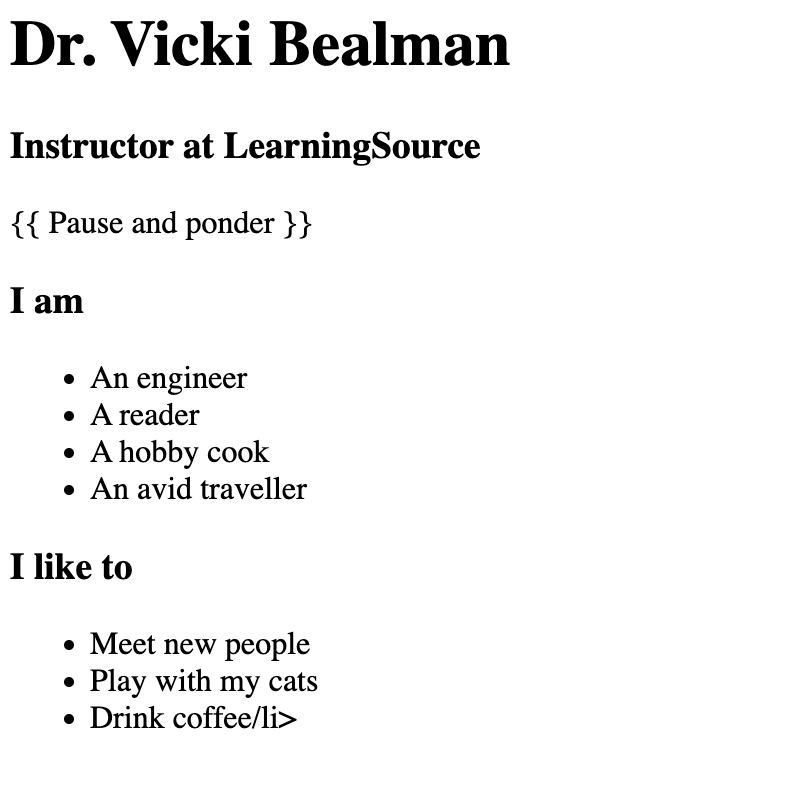
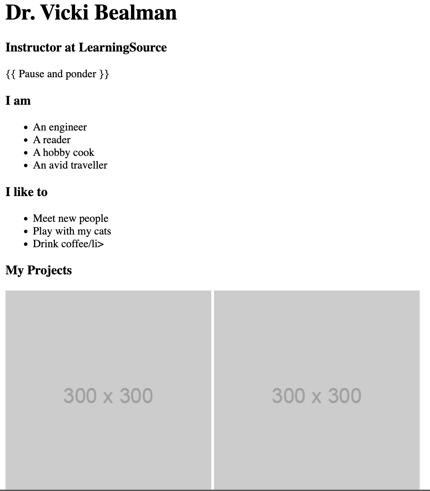
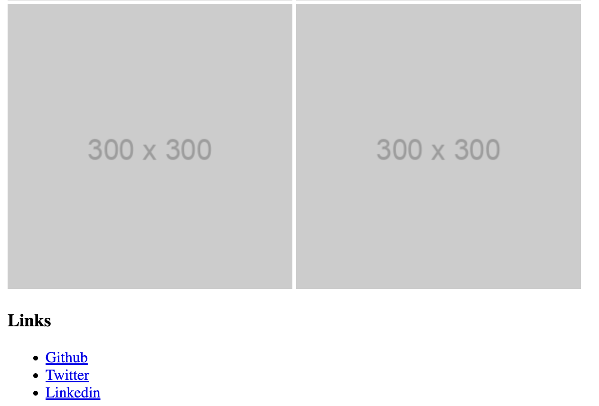
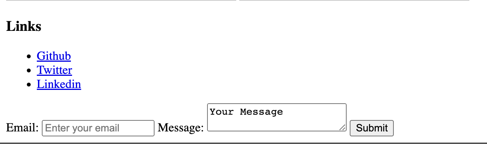
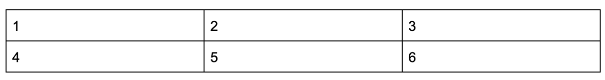

Looking at the mockup, you compartmentalize your page into sections.

- Introduction
	- Profile picture
	- Name
	- Title
	- Quote

- About
	- Who Am I
	- What do I Like

- Portfolio
- Links & Contact Me

Think in terms of sections, because as you’ll see, each of these bullet points will become a box in itself, with the sub points getting nested inside the main points. 

Let’s tackle them separately.

## Introduction

The introduction section contains an image (profile picture), a heading (name), a subheading (professional title) and a line of text (quote). 

- Start with the introduction box and add each of the nested elements into it. Note: this code goes inside the body tag, in between the opening and closing body tag (<body> and </body>).

```
<div>
  
  <h1>JDr. Vicki Bealman</h1>
  <h3>Instructor at LearningSource</h3>
  <p>{{ Pause and ponder }}</p>
</div>
```

## About

This section has two lists and a heading that goes with each list. 

- Notice this time we have two boxes (`div`s) nested within this one larger box. These are the left and the right box, each with its own heading (`<h3>`) and an unordered list (`<ul>`). 

Now,  write code for that just after the ending tag of the previous (Introduction) section `</div>`.

```
<div>
		  <h3>I like to</h3>
		  <ul>
			<li>Meet new people</li>
			<li>Play with my cats</li>
			<li>Drink coffee/li>
		  </ul>
		</div>
	  
	  </div>
```

  

## Portfolio

Awesome! 

Now tackle the Portfolio section. This section will contain four of your chosen project screenshots. You’ll see in your wireframe that we’re planning to arrange them in a 2x2 grid. You’ll be able to do that with CSS later. For now, let’s add a heading and four images using the <`img`> tag just below the previous section.

```
<div>
  <h3>My Projects</h3>
  
  
  
  
</div>
```



## Links and footer
0
Your final section is your footer (it is the vertical end of the webpage). It contains links to our online social profiles, like LinkedIn, Github, and Twitter, but you can replace them with your own custom links!

Note the <`user`> placeholder in the `href` attribute of the anchor element. You have to replace that with your respective `usernames` for those sites. 

For example, https://twitter.com/<user> will become https://twitter.com/drvicki to link the anchor element to my Twitter page, and similarly for other links. 

Place this section after the closing `div` tag of the Portfolio section.

```
<div>
  <h3>Links</h3>
  <ul>
    <li>
      <a href="https://github.com/<user>">Github</a>
    </li>
    <li>
      <a href="https://twitter.com/<user>">Twitter</a>
    </li>
    <li>
      <a href="https://linkedin.com/in/<user>">Linkedin</a>
    </li>
  </ul>
</div>
```



## Contact form
You’ll also have a ‘Contact me’ form with input fields. On a real website, it would enable people to send you a message. 

For now, the form you’re writing is just on the frontend. It won’t work since we do not have a backend for it yet.

```
<div>
  <form action="#">
    <label for="email">
      Email: <input type="email" id="email" placeholder="Enter your email" /> 
    </label>
    <label for="message">
      Message: <textarea id="message">Your Message</textarea>
    </label>
    <input type="submit" valid="Send Message" />
  </form>
</div>
```




# CSS

Create a file called `styles.css` the same way we created `index.html`. 

Add the following line just before the closing head tag (`</head>`) in your `index.html` file.

```
<link rel="stylesheet" href="styles.css">
```

Open `styles.css` file.

Code the following.

```
p { 
  font-style: italic;
}
```

Refresh the browser. Notice how “{{ Pause and ponder }}” appears in italics.

While this works, this would also make all the paragraph elements (`<p>`) on our page italic, which is probably not what you want. 

Let’s try to give this element (`<p>`) a specific identity so we can style that particular identity. Do this by adding a `class` attribute called ‘`quote`’. 

- Classes are used to define particular styles for all of the elements that share the same class name.

```
<p class="quote">
  {{ Pause and ponder }}
</p>

.quote {
  font-style: italic;
}
```

Did you notice a period (`.`) in front of the `class` name (that is, `.quote`)? That’s called a class selector. 

## CSS Selectors

A CSS selector selects a particular element or group of elements in the `HTML` and applies styles to just those. We’ve already looked at some of them, but let’s get to know them a bit better now.

### Element selector

An element selector selects one or more of a particular `HTML` element. An example of an element selector would be `p { }`, which, as we saw, styles all the paragraph (`<p>`) elements on a page.

### ID selector

ID selectors are similar to `class` selectors, except we set an ID to an HTML element using the `id` attribute and select it in CSS using the hash or pound character before the ID name.

## CSS Grid

CSS grid is a powerful tool used to structure parts of your webpage in a grid so you can organize and control the layout of your page. A grid in CSS is exactly what it is in real life; a space divided by horizontal and vertical lines into rows, columns, and cells—a table, if you’d like to think about it that way.

With CSS grid, first define how your grid is structured in terms of percentages, pixels, or any other measurements, and for each item we put into our grid, we define what cell that element should go in, roughly speaking.

Let’s look at an example using a simple 2x3 table:



To make this table, do the following:

`styles.css`
```
.grid-table {
  display: grid;
  grid-template-rows: auto auto;
  Grid-template-columns: auto auto auto;
}
```

`index.html`
```
<div class=”grid-table”>
  <div>1</div>
  <div>2</div>
  <div>3</div>
  <div>4</div>
  <div>5</div>
  <div>6</div>
</div>
```

# Now Position Elements on your Web Page

Give your website a fixed width center it on the screen. To do that, wrap all of your content in an `HTML` element and set equal ‘`margin`s’ (or empty space) on both sides.

`index.html`
```
<body>

<div class=”container”>

  <!-- all of your existing content goes here -->

</div>

</body>
```

`styles.css`
```
.container {
  max-width: 840px;
  margin: 0 auto;
}
```

Refresh the page, you’ll see there’s a `margin` on both sides of your content. This is called a fixed width layout (because we specified a particular width). 

Next have the name, professional title, and quote center aligned. Name the `div` holding your content ‘`intro`’, and then style it.

`index.html`
```
<div class=”intro”>
  <!-- content goes here -->
</div>
```

`styles.css`
```
.intro {
  text-align: center;
}
```

The ‘`about me`’ lists need to be arranged horizontally, one on the left and the other on the right. Let’s use CSS grid!

`index.html`
```
<div class="about-grid">
  <div class="i-am">
    <h3>I am</h3>
    <ul class="about-list">
      <li>An engineer</li>
      <li>A reader</li>
      <li>A hobby cook</li>
    </ul>
  </div>
  <div class="i-like">
    <h3>I like to</h3>
    <ul class="about-list">
      <li>Meet new people</li>
      <li>Play with my cats</li>
      <li>Drink Coffee</li>
    </ul>
  </div>
</div>
```

`styles.css`
```
.about-grid {
  display: grid;
  grid-template-columns: 50% 50%;
}

.i-am, .i-like {
  text-align: center;
  text-decoration: none
}

.about-list {
  list-style: none;
  padding: 0;
}
```

Notice how we declare a 2-column grid in the `.about-grid` class with 50% percent width each.

We would ideally like to have the “About me” lists to be one below the other on mobile devices and screens that are something like below 480px. Let’s write the code for that.

`styles.css`
```
@media (max-width: 480px) {
  .about-grid {
    grid-template-columns: 100%;
  }
}
```

In the links and contact section, content should also be divided into two columns, but not split by 50-50. Since links are relatively narrower, let’s split this into 30-70.

`index.html`
```
<div class="links-and-contact">
  <div class="links">
    <h3>Links</h3>
    <ul class="links-list">
      <!-- content -->
    </ul>
  </div>
  <!-- contact form -->
</div>
```

`styles.css`
```
.links-and-contact {
  display: grid;
  grid-template-columns: 30% 70%;
}

.links {
  justify-self: center;
}

.links-list {
  list-style: none;
  padding: 0;
}
@media (max-width: 650px) {
  .links-and-contact {
    grid-template-columns: 100%;
  }
}
```

